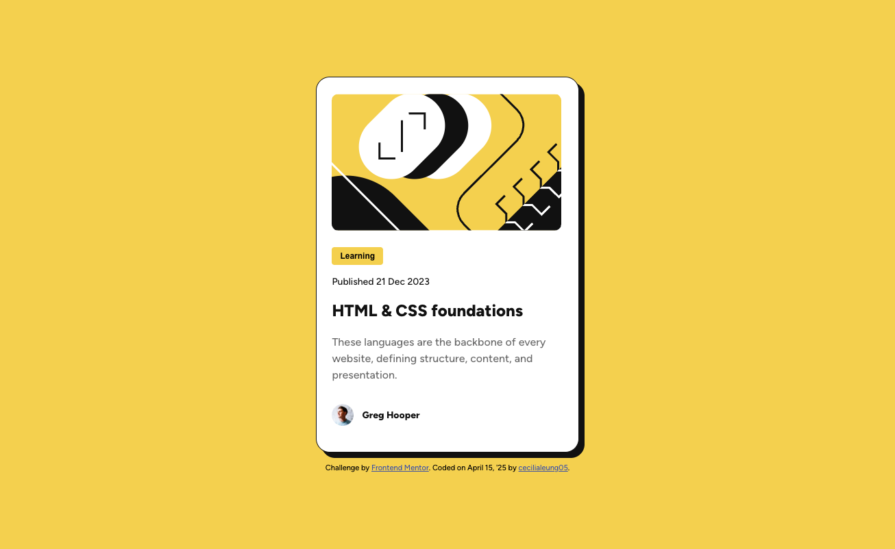
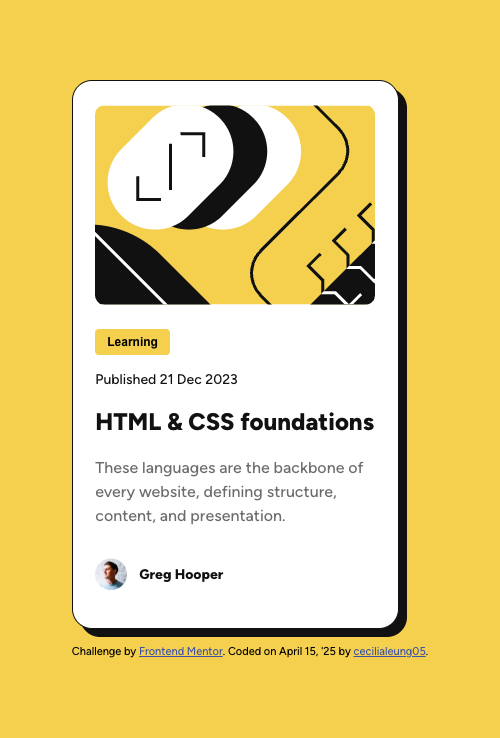

# Frontend Mentor - Blog Preview Card

## Table of contents

- [Overview](#overview)
- [Screenshot](#screenshot)
- [Links](#links)
- [My Process](#my-process)
- [Built With](#built-with)
- [What I Learned](#what-i-learned)
- [Continued Development](#continued-development)
- [Acknowledgments](#acknowledgments)

## Overview

This is my solution to the [Blog Preview Card challenge on Frontend Mentor](https://www.frontendmentor.io/challenges/blog-preview-card-ckPaj01cL). The goal was to create a responsive blog card component using semantic HTML and modern CSS layout practices.

### Screenshot

### Links

- **Solution URL:** [GitHub Repo](https://github.com/cecilialeung05/frontend-mentor-projects/tree/blog-preview-develop)
- **Live Site URL:** [Live Demo on Vercel](https://frontend-mentor-projects-cecilia.vercel.app/)

---

## My Process

### Built With

- Semantic HTML5
- CSS (Flexbox)
- Mobile design first workflow
- Desktop responsiveness at 1440px breakpoint
- Google Fonts (Figtree)
- `box-shadow`, `border-radius`, and hover states

### What I Learned

This project helped solidify my understanding of:

- Translating Figma specs into clean, maintainable code
- Managing responsive typography and layout
- Structuring reusable BEM-style CSS classes
- Creating subtle, accessible hover effects

### Acknowledgments

- Thanks to the Frontend Mentor team for another excellent design brief and structured practice challenge.
