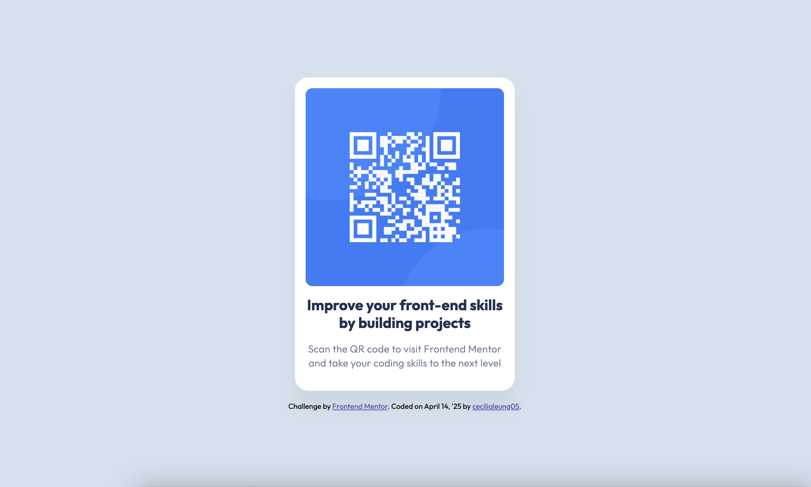
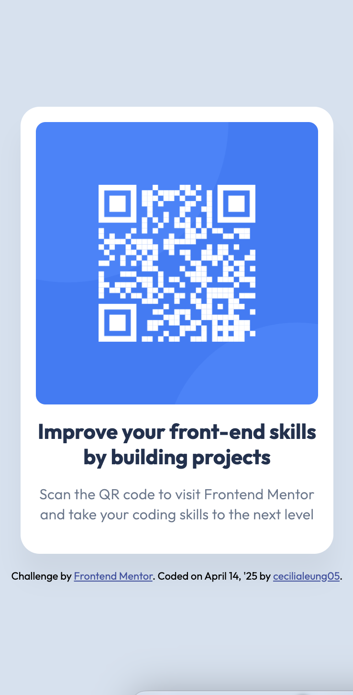

# Frontend Mentor - QR code component

## Table of contents
    
  - [Overview](#overview)
  - [Screenshot](#screenshot)
  - [Links](#links)
  - [My Process](#my-process)
  - [Built With](#built-with)
  - [What I Learned](#what-i-learned)
  - [Continued Development](#continued-development)
  - [Acknowledgments](#acknowledgments)
  - [Submitting Your Solution](#submitting-your-solution)
  - [Sharing Your Solution](#sharing-your-solution)

## Overview

This is my solution to the [QR Code Component challenge on Frontend Mentor](https://www.frontendmentor.io/challenges/qr-code-component-iux_sIO_H). The goal was to build a clean, responsive QR code component using HTML and CSS, matching the provided design as closely as possible.

### Screenshot

### Links

- **Solution URL:** [Your GitHub Repo](https://github.com/cecilialeung05/frontend-mentor-projects/tree/qr-code-develop)
- **Live Site URL:** [Live Demo on Vercel](https://frontend-mentor-develop-cecilialeung05.vercel.app/)

---

## My Process

### Built With
- Semantic HTML5
- CSS3 with custom properties
- Flexbox for layout
- Mobile-first workflow

### What I Learned
This project helped reinforce the importance of:

- Using `box-sizing: border-box` for consistent spacing
- Creating fully responsive layouts with `max-width` and `width: 100%`
- Matching Figma shadows in CSS using `rgba()` and `box-shadow`
- Structuring clean, accessible HTML for simple components

### Continued development
  - Creating my own custom QR code that links to my portfolio or LinkedIn profile for branding.

### Acknowledgments
  - Thanks to the Frontend Mentor team for providing such a helpful and practical design challenge. 
