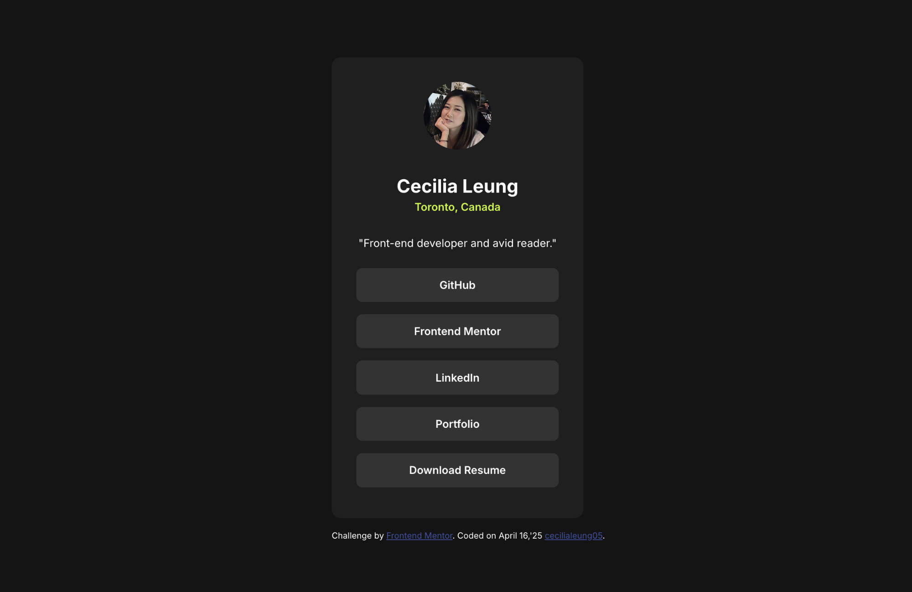
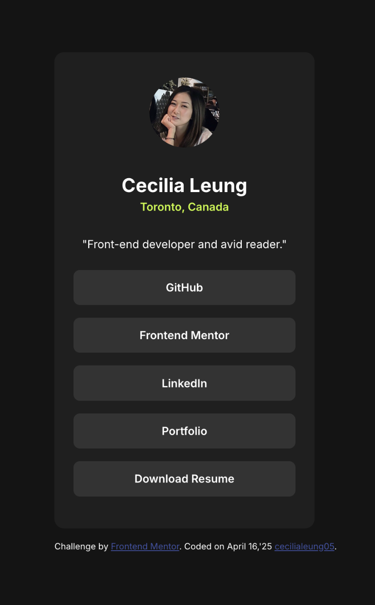

# Frontend Mentor - Social Links Profile

## Table of Contents

- [Overview](#overview)
- [Screenshot](#screenshot)
- [Links](#links)
- [My Process](#my-process)
- [Built With](#built-with)
- [What I Learned](#what-i-learned)
- [Continued Development](#continued-development)
- [Acknowledgments](#acknowledgments)

## Overview

This is my solution to the [Social Links Profile challenge on Frontend Mentor](https://www.frontendmentor.io/challenges/social-links-profile-UG32l9m6d). The objective was to create a responsive profile card with accessible social media links and visually appealing hover and focus states.

### Screenshot

  

## Links

- **Solution URL:** [GitHub Repo](https://github.com/cecilialeung05/frontend-mentor-projects/tree/social-links-profile-develop)
- **Live Site URL:** [Live Demo on Vercel](https://frontend-mentor-projects-cecilia.vercel.app/social-links-profile)

---

## My Process

### Built With

- Semantic HTML5
- CSS (Flexbox and Grid)
- Mobile-first responsive design
- Accessible keyboard navigation
- Google Fonts (Inter)
- BEM-style class naming for clarity and scalability

### What I Learned

While working on this challenge, I improved my ability to:

- Structure semantic and accessible HTML content
- Implement hover and focus styles for keyboard navigation
- Fine-tune alignment, spacing, and visual hierarchy using modern CSS
- Maintain clean, reusable class names with BEM methodology

## Continued Development

In the future, I plan to:

- Animate hover/focus states for more engaging feedback
- Add support for additional social networks
- Explore theming or dark mode toggle using CSS custom properties

## Acknowledgments

- Thanks to the Frontend Mentor team for creating challenges that sharpen real-world development skills.
- Appreciation to the developer community for sharing solutions and encouraging growth.

